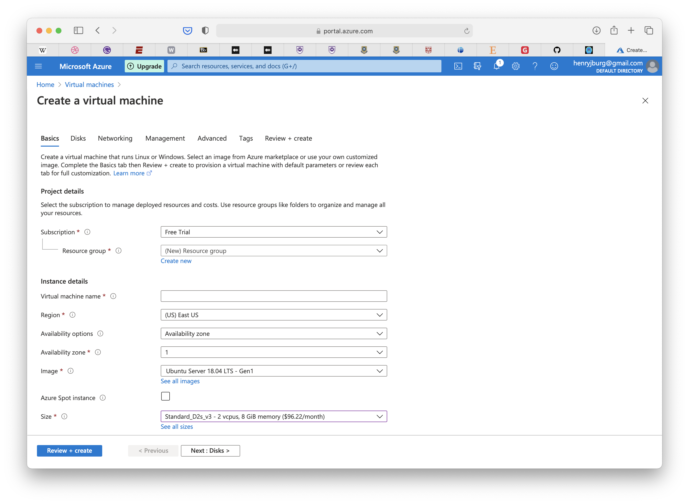
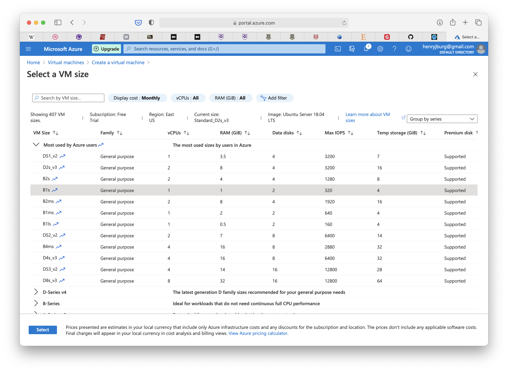
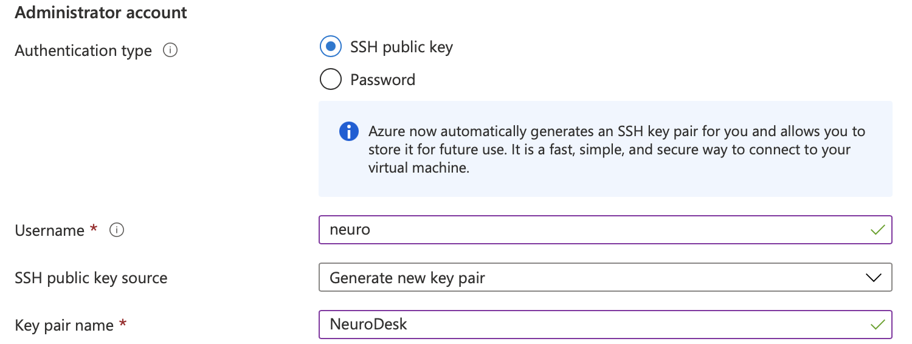
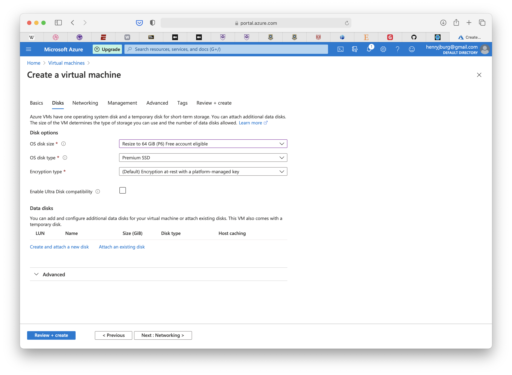

⚠️ **This guide is outdated, please read the updates at the [end](#updates) of this post for up-to-date advice.**

The free tier gives provisions for 750 hours of Azure B1S General Purpose Virtual Machines for Linux, documented [here](https://azure.microsoft.com/en-in/free/free-account-faq/).

## Creating a Virtual Machine in Azure

### Configuring Resources


From the Azure portal landing page, navigate to “Virtual machines”. Once on the “Virtual machines” page, click “Add” in the top left corner, and then click “Create a virtual machine”.



Under Size, be sure to click “See all sizes”.


Select B1s, to ensure you qualify for the free 750 hours, then click “Select” to return to the “Create a virtual machine” page.



### Configuring Access

It’s best to create an SSH key to enable access to the virtual machine instance remotely.



The parameters above would suffice, however feel free to change the administrator username or key pair name to what works best. The remaining settings can be left as is, click “Next : Disks >” down the bottom of the page to proceed to the next stage.

### Configuring Disks

Change OS disk size to 64 GiB as this is eligible for a Free account.



### Create virtual machine

The remaining steps don’t need to be set or changed, click “Create” after clicking the “Review + create” button.

## Accessing the VM

After downloading and installing the SSH certificate, wait for the instance to deploy.


When the resource has deployed, copy the public IP address to configure SSH access.

Run `ssh -i <Path to your private key> -L 5900:127.0.0.1:5900 -L 6080:127.0.0.1:6080 username@yourPublicIP` to setup a link from your local machine to the remote instance.

## Setup the VM

To setup Docker installation:

```Bash
sudo apt-get install \
    apt-transport-https \
    ca-certificates \
    curl \
    gnupg-agent \
    software-properties-common
```

Add Docker’s GPG key:

```Bash
curl -fsSL https://download.docker.com/linux/ubuntu/gpg | sudo apt-key add -
```

Add the ‘Stable’ Repository:

```Bash
sudo add-apt-repository \
    "deb [arch=amd64] https://download.docker.com/linux/ubuntu \
    $(lsb_release -cs) \
    stable"
```

Install the Docker engine and CLI:

```Bash
sudo apt-get update
sudo apt-get install screen docker-ce
```

Check Docker is working:

```Bash
sudo systemctl enable --now docker
sudo systemctl status docker
```

Start or reconnect to a screen session:

```Bash
screen -R
```

Create a directory for the persistent data:

```Bash
mkdir ~/vnm
```

Start the NeuroDesk container (this may take a while):

```sudo docker run --privileged --name vnm -v ~/vnm:/vnm -v /dev/shm:/dev/shm -e USER=neuro -p 6080:80 vnmd/vnm:20210708```

Once the container has started and you see a message similar to `novnc entered RUNNING state`, you are ready to go!

Locally, navigate to `http://localhost:6080/` to access the instance via a web browser. Ensure you have configured the port-forwarding correctly.


If you have any additional issues in following this guide, check out the repository for the container on GitHub [here](https://github.com/NeuroDesk/vnm/).

## Updates

### December 2021

This guide hasn't been updated for a while, I would recommend you look at the NeuroDesk cloud [documentation](https://neurodesk.github.io/docs/neurodesktop/getting-started/cloud/) instead.

### August 2021

Trying to install `dockerce` will fail, the package `docker-ce` should be installed instead. This guide previously used a version of NeuroDesk from 2020, the `docker run` command has been updated to use just the latest version of the NeuroDesk image.
