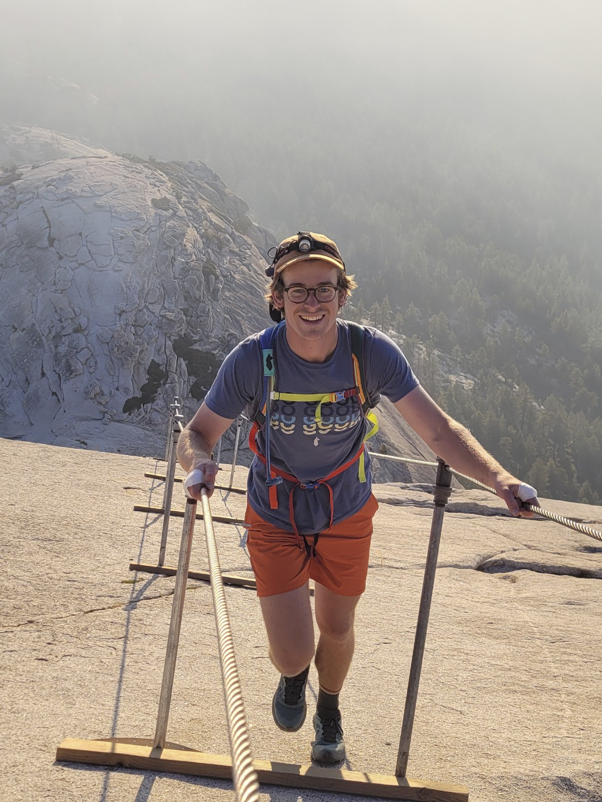

Half Dome was easily the biggest adrenaline rush I had during my time in Yosemite National Park. I was fortunate enough to get lottery
passes to do Half Dome after applying only a day or so before!

We got up at about 3 AM to get the initial miles to the base of the climb done by sunrise, and we were definitely rewarded
with a beautiful sunrise that day.

Walking up the side of Half Dome is no joke, I'd like to say I challenge myself but this was one of the few times I almost
turned around. As you're going up, not only is the gradient close to 80% at times, your left and right drops off very quickly.

We had tape around our hands to help our grip and prevent blistering. The view was incredible as well!

Here's a view from the base of Half Dome to give a sense of the incline.
