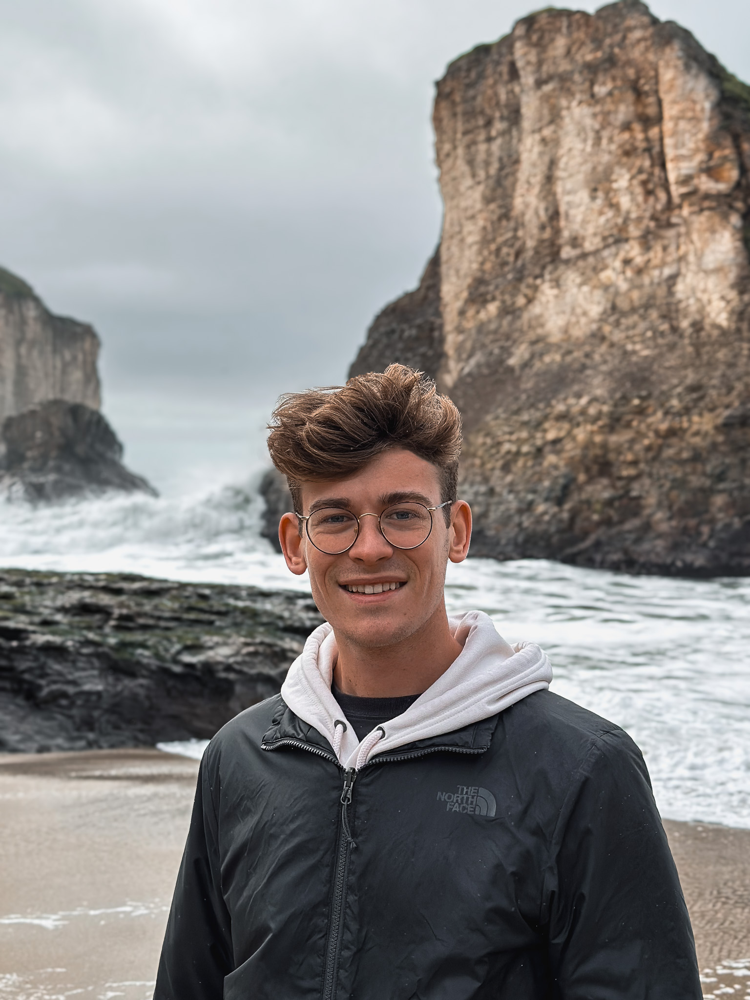
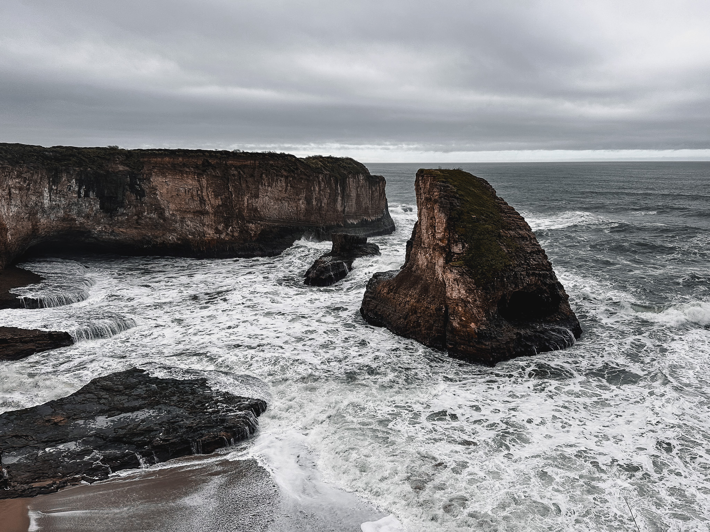
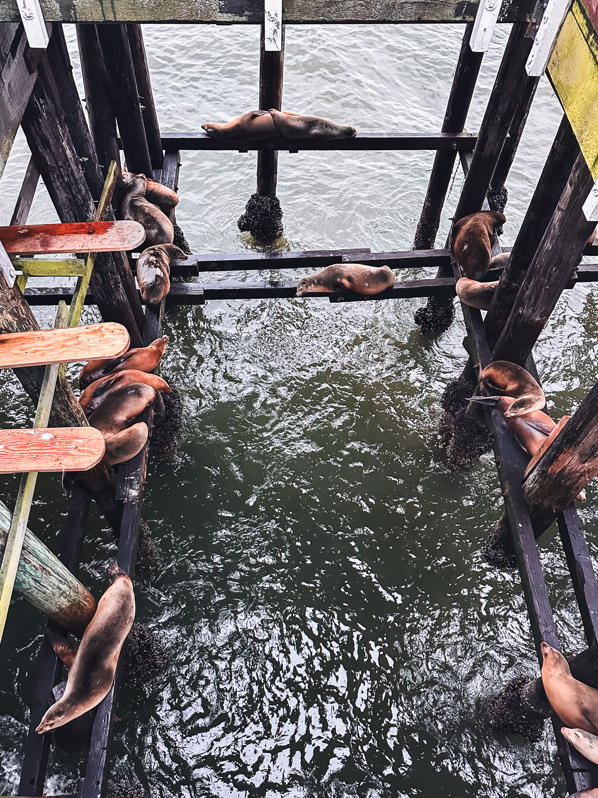

After 2023 was less travel-filled compared to 2022, I set some goals to continue to get out a bit more and cover off more of the US that I was keen to see. It was almost 12 months since I last visited my friends in San Francisco, so I found some cheaper fares and headed over for a weekend in January. At the end of my last entry about San Francisco, I mentioned Monterey was driving distance from SF, so this time I decided to rent a car for a day and drive south to check it out!

We set out just before 9 AM from downtown SF and set the first stop to be **Shark Cove Bay**. We went along CA-1, since this would avoid any congestion around San Jose, but also have more scenic views as it runs largely along the coast. After about an hour of driving, we arrived at Shark Cove Bay.

There isn't a clearly marked turn or carpark, but you are able to see the trails on a map. I would make sure you keep an eye on a map so you don't accidently miss it! There is a gravel area to the side of the road that you can pull off onto.

You can then walk down to a fork with some signage and rubbish bins - left and under the pole leads down a trail to the bay itself, and going right allows you to walk up along the cliffs and get a view over the entire bay.

Above is the view over the bay, you can see where the "shark" name comes from! You can walk right up to the edge of the cliff, but be particularly careful in wet weather. It was particularly windy at this point!

Once you reach the bay itself, you are presented with a spectactular outlook to the famous rock formation! Be aware of the tides so you don't get your shoes wet. From Shark Bay Cove, head about another hour south and just past Monterey you'll reach **Carmel-by-the-Sea**. This is a beautiful little town, with upmarket shopping and dining all within a walking distance of some of the cleanest beaches I've seen in the US.

From Carmel-by-the-Sea, you can continue north again to Monterey. We decided to head to **Santa Cruz** instead, intending to catch the sunset from the boardwalk.

Unfortunately it was too overcast to see any good sunset, but there were plenty of sea lions hanging around! We didn't walk along too much of the boardwalk, but there is plenty to do around that area. After having dinner in Santa Cruz, we returned to SF, rounding out the trip by 8 PM.

Sure, it was overcast and slightly rainy for most of the day, but the incredible views can't be washed away! I really enjoyed this little roadtrip and would highly recommend doing something similar if you have a car and an empty day in SF.
