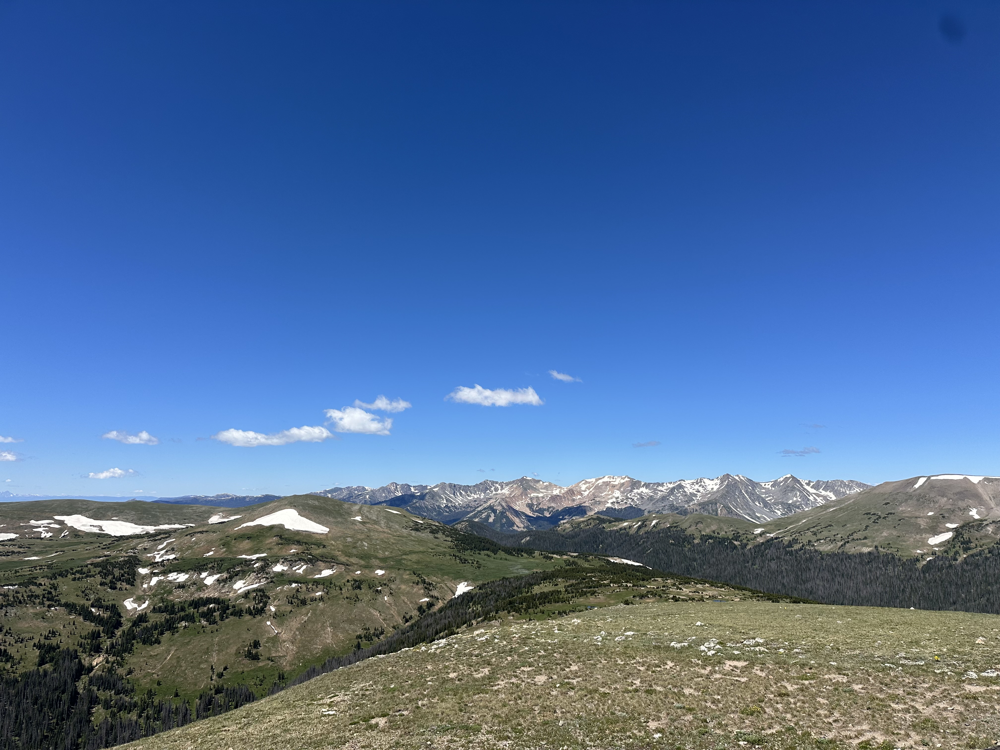
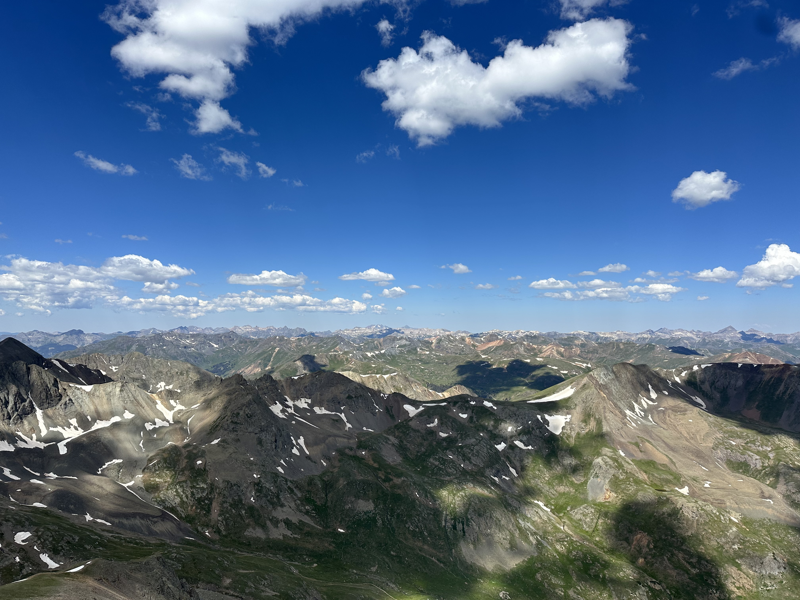
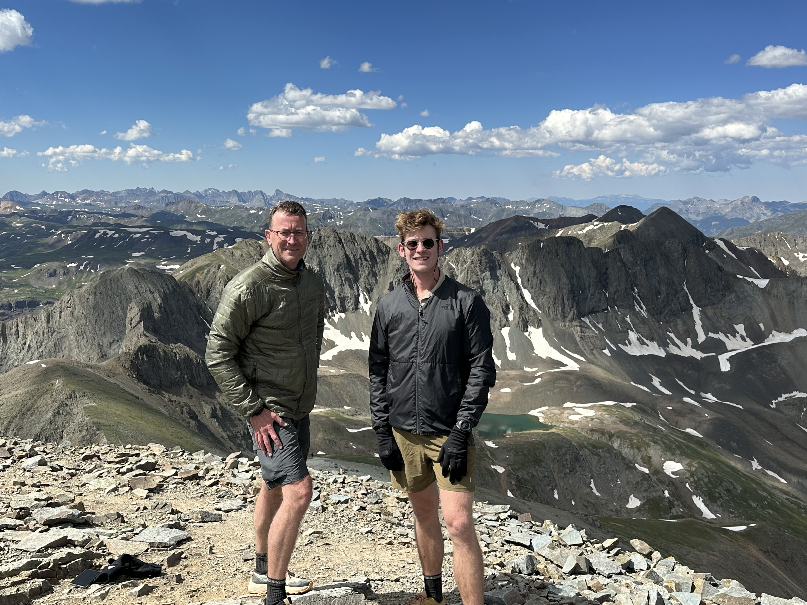
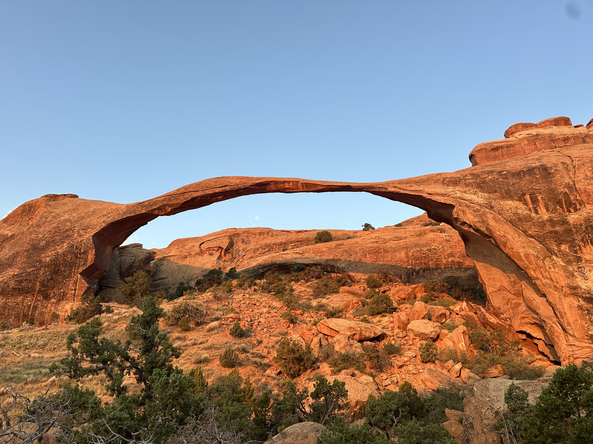
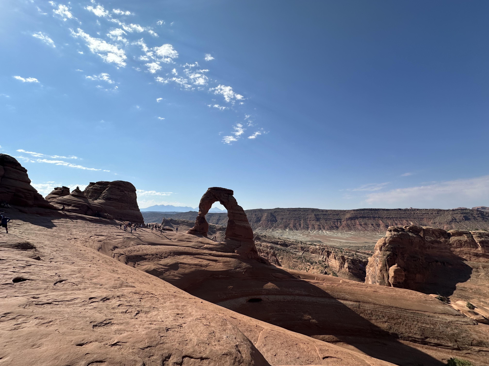
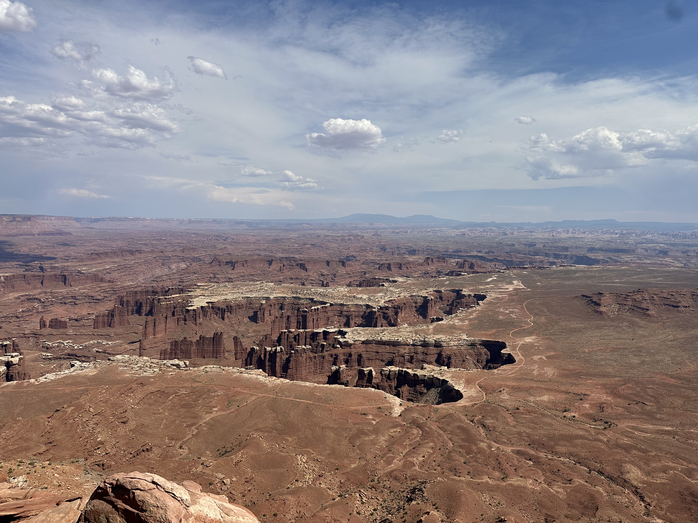

Colorado and Utah are two US states that had been on my bucketlist for a while. When my dad came over to visit through
July, we set aside about 10 days to drive out from St. Louis to Colorado, covering a lot of Colorado and stopping in
eastern Utah for two days.

Driving from St. Louis was split over two days, the first night was spent in Hays, KS, a small western town with a lot of charm
to it. The second day we drove through to Denver, before ultimately our cabin accomodation in Estes Park!

The first day in Estes Park, we hiked out to Balanced Rock, via Gem Lake. It's worth noting for the timed-entry permits,
if you want to see areas such as Cub Lake, you need to get the specific timed-entry permit to even get access to the
road leading to these trailheads. I hadn't realised this, but fortunately Gem Lake is a really great alternative, with
beautiful lake views.

We started early and covered about 8 miles. This was great for adjusting to the altitude given we were planning on a
hike at elevation a few days later. The next day, we took a roadtrip through Rocky Mountain National Park, visiting spots
such as the Alpine Visitors Center and doing a few small hikes for some spectacular views over the parks.

After Rocky Mountain National Park, we headed down through Gunnison to Lake City, located in the most remote county of
the continental United States (over 96% is public lands). I really loved Lake City, it has a blend of small
town charm, with proximity to some great hiking trails. We used this as a base to hike Handies Peak, one of the few
relatively low-risk 14-ers in the region.

Hiking Handies Peak was an amazing experience. We left Lake City early in the morning, since the drive to the trailhead
is about 1.5 hours each way, with dirt roads and uneven terrain most of the way. We started at the American Basin
trailhead, which was quite accessible in a Mazda CX-30 with AWD and a bit of clearance.

The hike itself was spectacular. Before you start the final summit approach, you pass by a lake at the base of nearby
peaks.

The entire loop was about 8 miles. The summit push was particularly challenging, it opens up to become a gravel incline,
where every step feels like you are almost out of breath. This was very different to my experience on Mt. Whitney, where
the summit push, while a challenging terrain, didn't feel as steep. We were stopping every ten paces or so to catch our
breath! The view at the summit was incredible.

The summit itself was a small area, and continued onwards to an alternate route down the peak. It was definitely a great
challenge that was absolutely worth the hard work.

After Handies Peak, we headed out to Utah. Our plan was to stop in Moab for two nights and attempt to cover as much of
Arches and Canyonlands National Parks as we could in those two days. It was incredibly hot (over 40 degrees Celsius) the
entire time we were there.

We got up very early one morning to go view sunrise at Landscape Arch, and this was a beautiful experience. The weather
was pleasant, and the colours on the arch were incredible.

After stopping at Landscape Arch, we drove through the park to hike to Broken Arch, and then Delicate Arch. By this
time it was about 10 AM and the sun was really out. We hiked through to Delicate Arch which was already swarming with
other hikers, but was a great photo opportunity under a spectacular rock formation.

Following this, we retreated back to the AC in our accomodation and prepared for the next day. We did a driving tour
of Canyonlands, since the weather was still dangerously warm, and the hiking just isn't as spectacular unless you
are committing to one of the longer hikes in the park. The views were incredible, almost surreal seeing these canyons
from the various vantage points.

After our time in Moab, we started a return to St. Louis, but stopped in Colorado Springs for two nights. This was a
great location to stay in to do the drive up Pikes Peak, our second 14-er of the trip. Driving up was an awesome
experience, being a motorsport fan and knowing some of the racing history of the peak. After Pikes Peak, we headed for
a drive through the Garden of the Gods, full of unique rock formations and tucked away in what felt like just the
suburbs of Colorado Springs!

Finally, we continued the long drive back to St. Louis, with our next stop in Manhattan KS, before the final day
returning to St. Louis. This was an awesome roadtrip, we covered close to 4000 miles while getting to see some more of
the incredible beauty the United States has to offer.
