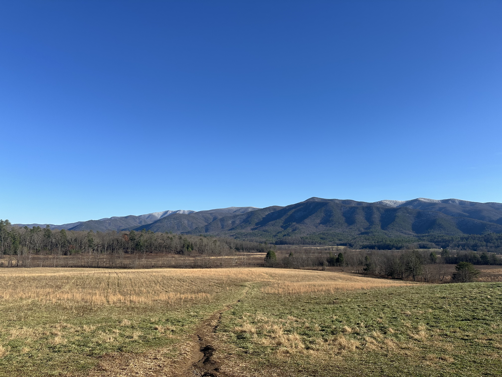

My parents were visting through December, so we made the trip out to the Smokies to spend a couple of days outside of St. Louis. We drove, so this gave us plenty of flexibility to explore the area.

Our first stop was a cabin in Seiverville, which was stunning winter experience, having only a dusting of snow for our entire stay.

While in the area, we hiked some short trails within the Great Smoky Mountains National Park. The temperatures were very moderate considering the time of year, and we were fortunate to not have any significant snowfall.

We also did a short self-directed driving tour around the Cades Cove region, with plenty of open plains surrounded by the mountains.

[Little River Outfitters](https://littleriveroutfitters.com/) was also worth the stop on the way out as we returned to Nashville for our last night in Tennessee. We stayed again in a cabin about 15 minutes outside of downtown Nashville, and this gave us a great location to explore the surrounding areas.

To round out our time in Tennessee, we stopped in Franklin to take in the Dickens festival that was happening that weekend along the main street.
