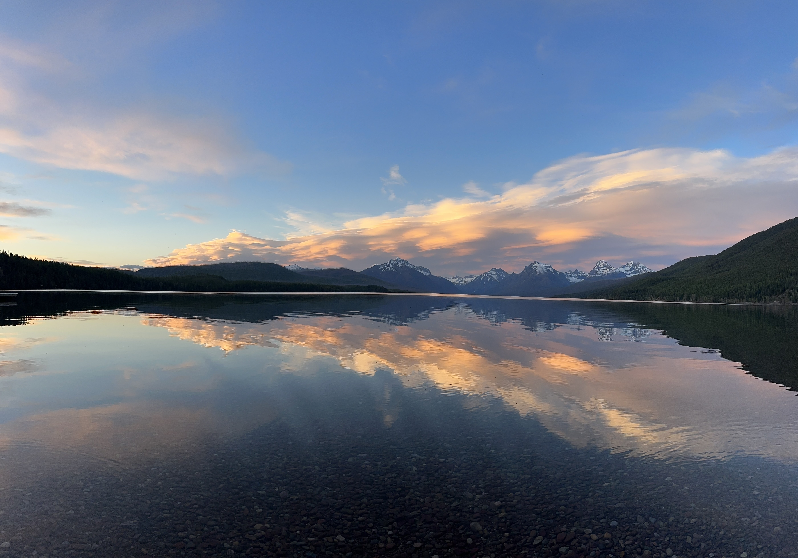
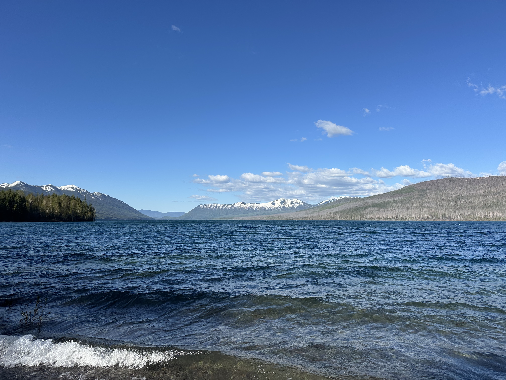
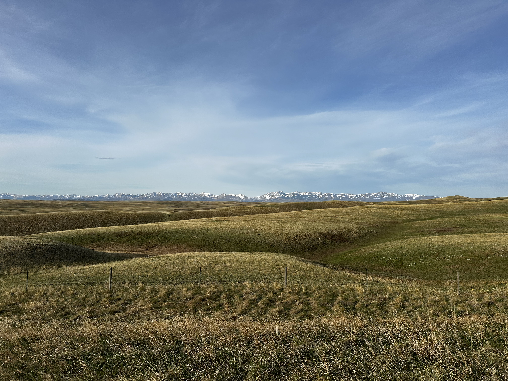
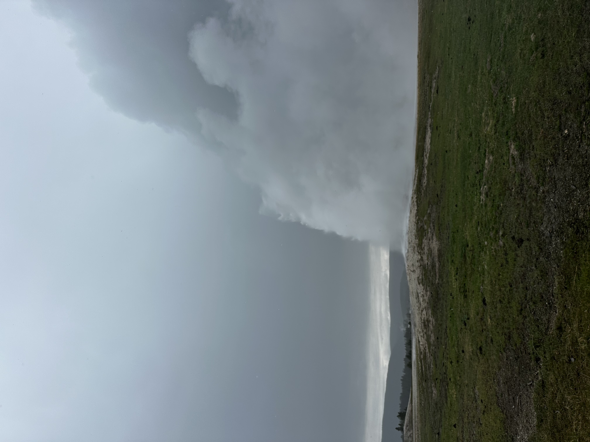

In early May, I embarked on a solo trip aiming to cover multiple National Parks across Montana and Wyoming. This was to take advantage of the two week break I had between semesters!

I flew into Bozeman airport (probably my favourite airport), and picked up a 2021 Nissan Frontier to be my transport for the next 6 days. I first made the 6 hour drive to Glacier National Park, where I would be camping for the next two nights. After 12 hours of travel, I ended the day with a stunning view beside Lake McDonald!

The next day, I made the drive along the open portion of Going to the Sun Road. This truly was the most beautiful road I have ever driven. This was a great time to visit Glacier, since it was re-opening for the season and was very quiet, without the adverse weather.

Based on a recommendation from a National Parks worker, I drove up to Polebridge, a tiny town within 20 miles of the Canadian border. Here, I had a great huckleberry bearclaw pastry, as well as a surprise cappucino! This was a great stop, hardly 40 minutes north of the park, that is absolutely worth your time.

That night, there had been reports of bear activity nearby, so I decided to sleep in the car. I used this as an opportunity to get an early start on my next driving leg, which was to head down to Yellowstone National Park.

Despite being mostly highway miles, these were some top-tier highway miles from the views alone. I made several unplanned stops to take a closer look at some of the beautiful mountains and creeks that were just along the way!

When I arrived a Yellowstone, I was quite tired, so I made the decision to spend more time in Yellowstone than trying to go down to Grand Tetons and back. I don't regret this, since the time in Yellowstone was more restful, and allowed me to explore the park more completely. Arriving at Gardiner for the first night, I stepped outside at dusk and heard live music. I decided to just follow the sound, and ended up sitting at a small outdoor bar for a few hours, listening to a country music cover band.

The next few days, I explored Yellowstone, starting with all the hot springs.

There were plenty of bison to be spotted! One day I was driving back to my campsite and briefly had to wait while a pack of over 20 bison walked up the lane right beside me! Truly awesome animals.

I wanted to do some hiking while I was there, but the day I went to do Bunsen Peak, I had to turn around due to bad weather rolling in. Also, I was the only person on the trail, and even though I had bear spray I wasn't looking for an encounter with no one else around.

Obviously, I had to go see Old Faithful. I spent 20 minutes standing in the pouring rain waiting for it to erupt, and fortunately it was worth it!

I spent the last few days in Pray, MT, staying in a remote cabin. This was a very restful time and a great way to cap off an excellent trip before I returned to Bozeman and flew back to St. Louis.

