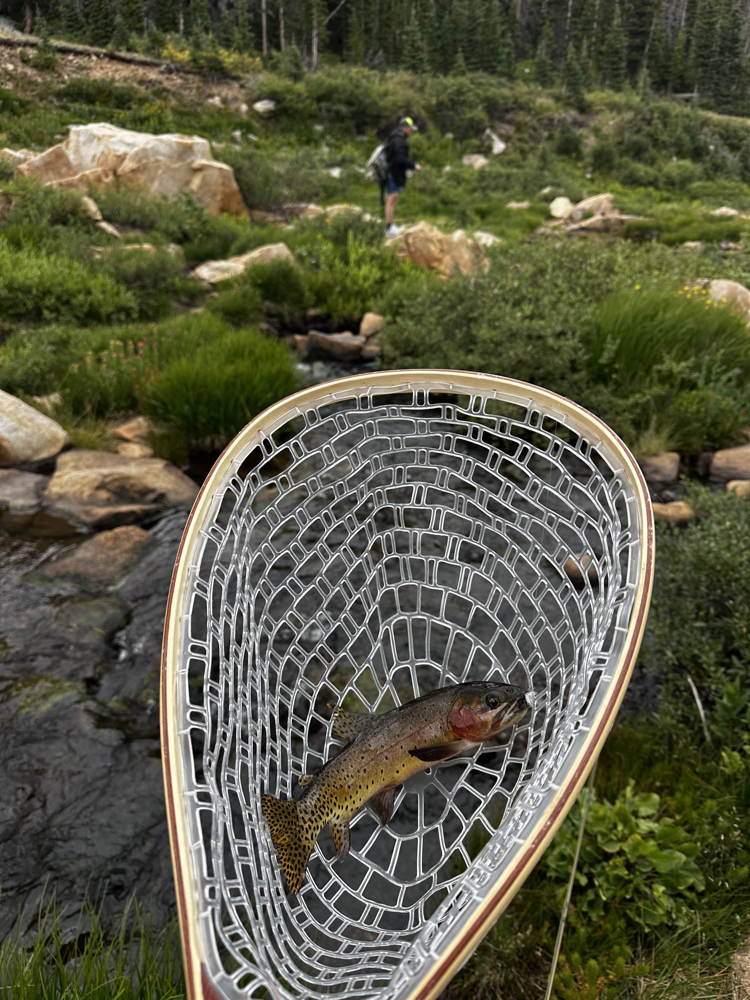
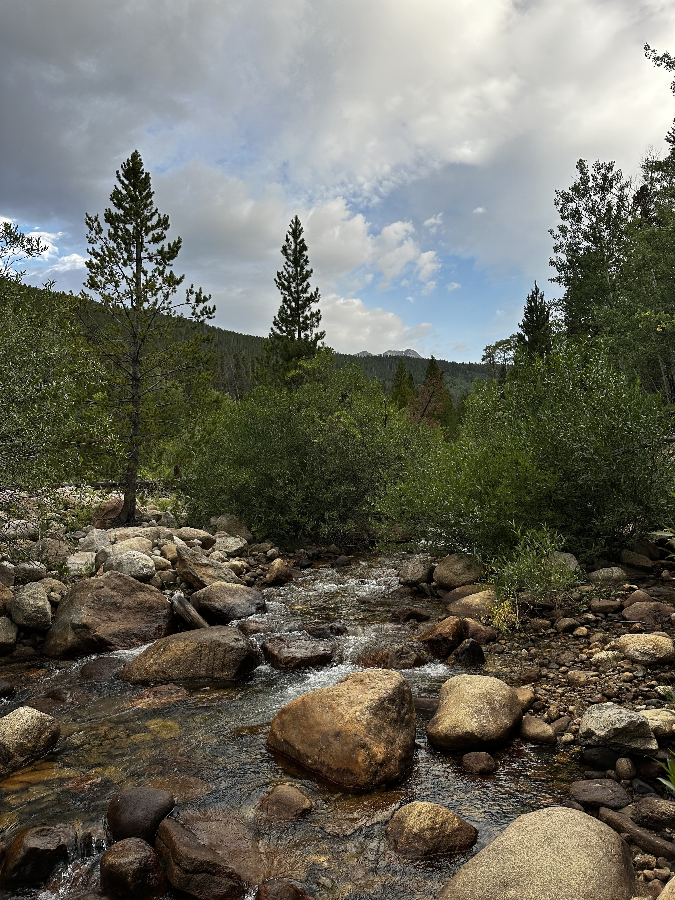
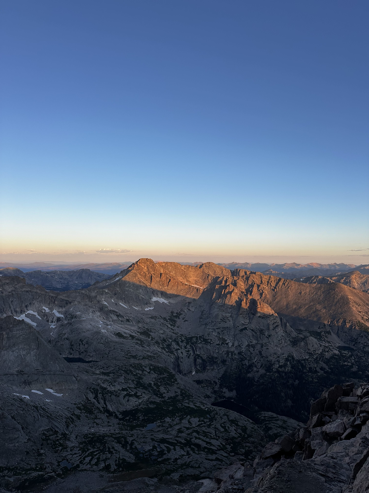
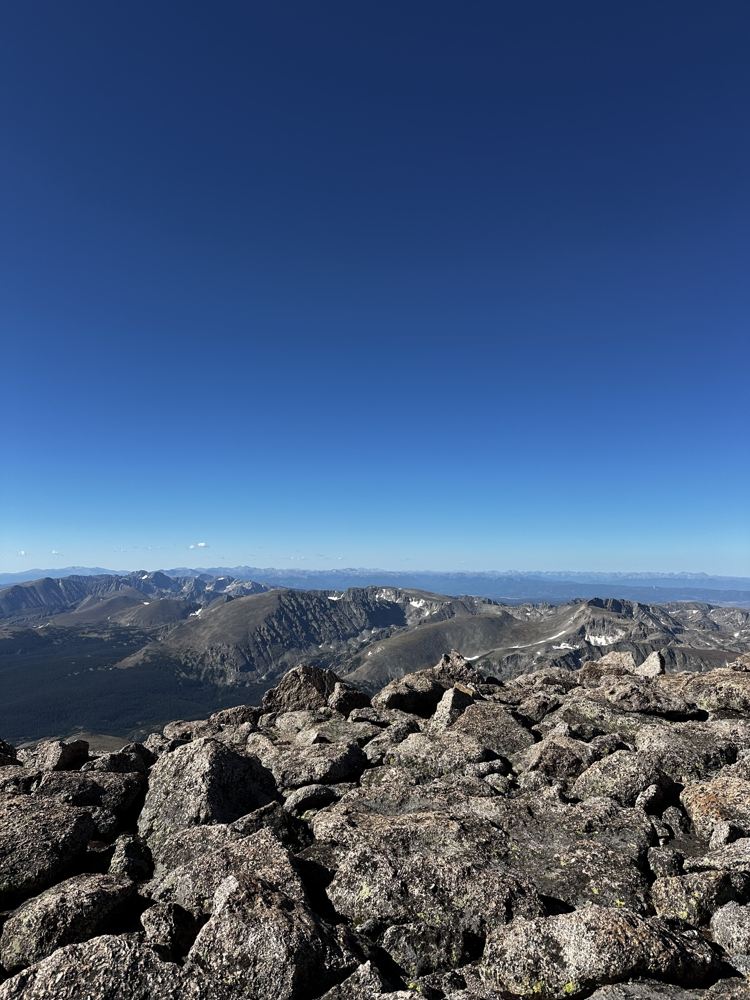
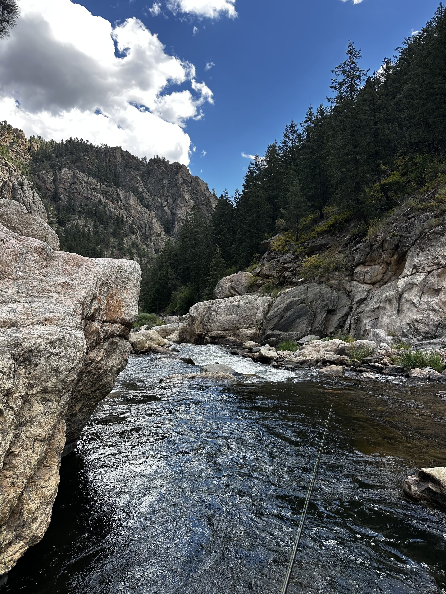

My buddy Carl and I hadn't been able to go on an adventure in a while so we found a weekend in August we could take a
roadtrip out to Colorado and tackle a bucket list summit of ours: Longs Peak.

Longs Peak is the most prominent summit within Rocky Mountain National Park and is visible throughout the majority of the park. It's Class III, meaning there's a fair bit of scrambling towards the summit, and unfortunately has a reputation for being deadly due to its accessibility to inexperienced hikers.

Carl and I are avid fisherman, and I credit Carl for getting me into fly fishing specifically (see my [Mt. Whitney, CA](/2022-08-22-mt-whitney) trip). We made the drive from St. Louis and spent the first few days acclimating and chasing trout.

We hiked into a lake (6 miles each way) that had an incredible population of native cutthroat trout that were largely unfished.
We spent most of the day pulling in these beautiful fish, including from the streams feeding and leaving the lake.

It really was the perfect day, especially since the scenery from the hike was hard to argue with. After a day or two
to acclimate, we began the Longs Peak hike around 2 AM. We were anticipating a great day weather-wise, so all the criteria
were aligning for a successful summit.

I took this photo just as the sunrise was breaking over the summit of Longs Peak. This has been my phone background for
a while, and it was very reminiscent of the sunrise hiking Mt. Whitney years earlier. We hiked the Keyhole Route. The
hike was hard, it was exposed, and it really challenged my fitness. There were multiple spots where losing your footing would definitely be fatal!

The summit made it all worth it. I needed 20 minutes just to sit down and catch my breath! About 1,500ft below the summit,
I had begun to experience what genuinely felt like rapid-onset pneumonia. Unbeknownst to me at the time, I had actually
begun to develop High Altitude Pulmonary Edema (HAPE), a very dangerous condition at altitude that is different to typical
Acute Mountain Sickness (AMS).

I wasn't aware of this condition and assumed I might have been getting sick. Before we had even reached the summit,
I had to stop to catch my breath every 5-10 steps and felt like my chest was tightening. Due to my stubbornness, we
had pushed through (Carl was very patient), but really I should have descended as my symptoms got worse. Praise God,
we made it back down safely, and I went to an Urgent Care in Estes Park where I was put on oxygen for 20 minutes to
help alleviate the symptoms.

I learnt a valuable lesson about being informed on all altitude-related sicknesses, and the gravity of it being close to
a life-threatening experience led me to decide to take a break on 14ers for now!

We decided to relax for the next day and drove to some nearby streams and continue to look for trout. We didn't have
much success that day but we had more than achieved our goals for the trip!

Overall, this was an awesome trip. It was a lot to pack into a long weekend, but Longs Peak was a thrill (aside from it
being a near-death experience) and the fishing was incredible.
