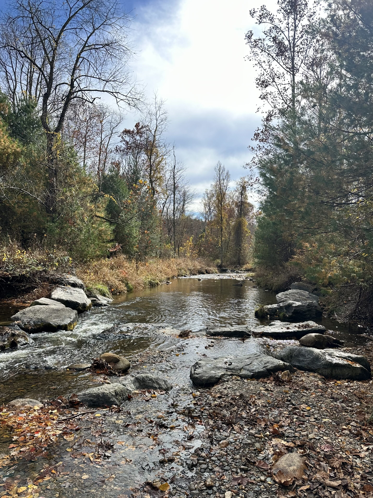
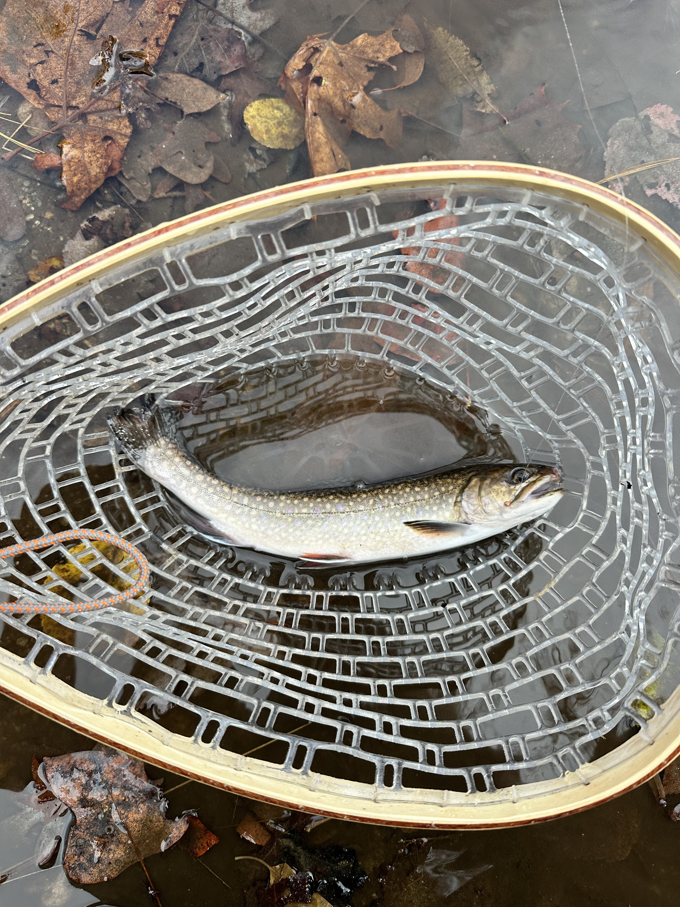
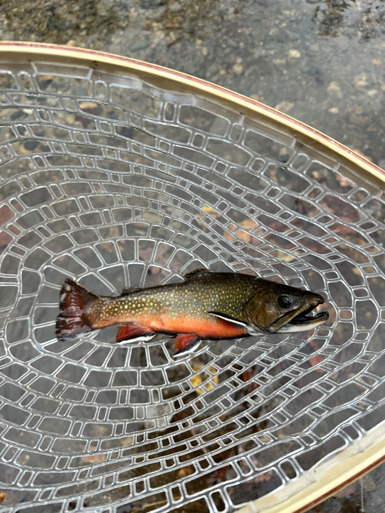

I had some friends of mine getting married just outside of Raleigh, so I made sure to pack my fly fishing gear and headed
out for a day trip to Stone Mountain State Park.

I had planned on hitting a few streams in the park, and the above picture was the first stream I stopped at. Maybe I
should've bought a lottery ticket that day, because hiking down a few meters from the carpark near the stream, I found
an incredible pocket of trout.

I spent the next two hours catching fish after fish! Ultimately, I caught multiple rainbows, browns (above), and even
one brook trout! I had never caught a brook trout before, and this one was a beautiful example.

Eventually I think the fish caught on to what was happening and began to ignore my flies. I took that as a sign to call
it a day, and I didn't bother with my other spots, this had been more successful than I could've imagined!

2025 was a great year for trout fishing!
