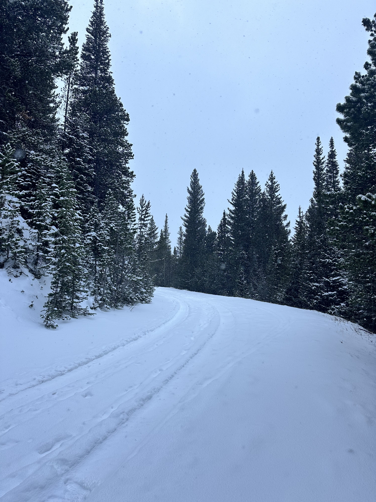
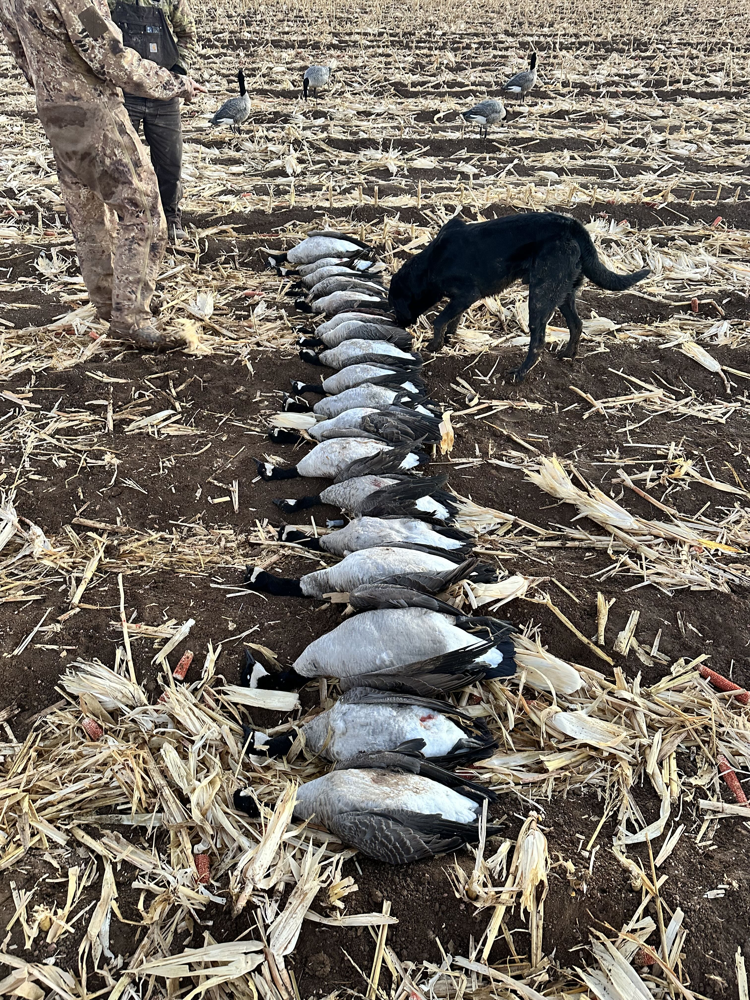
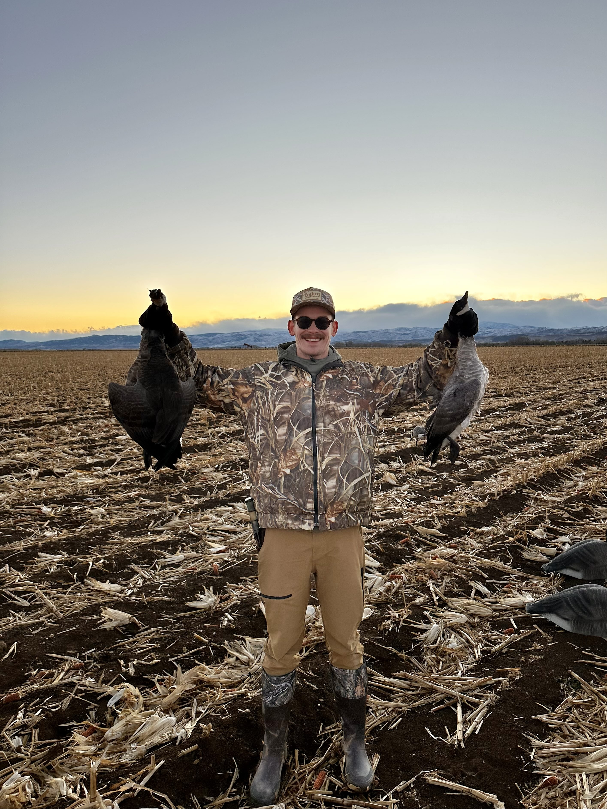
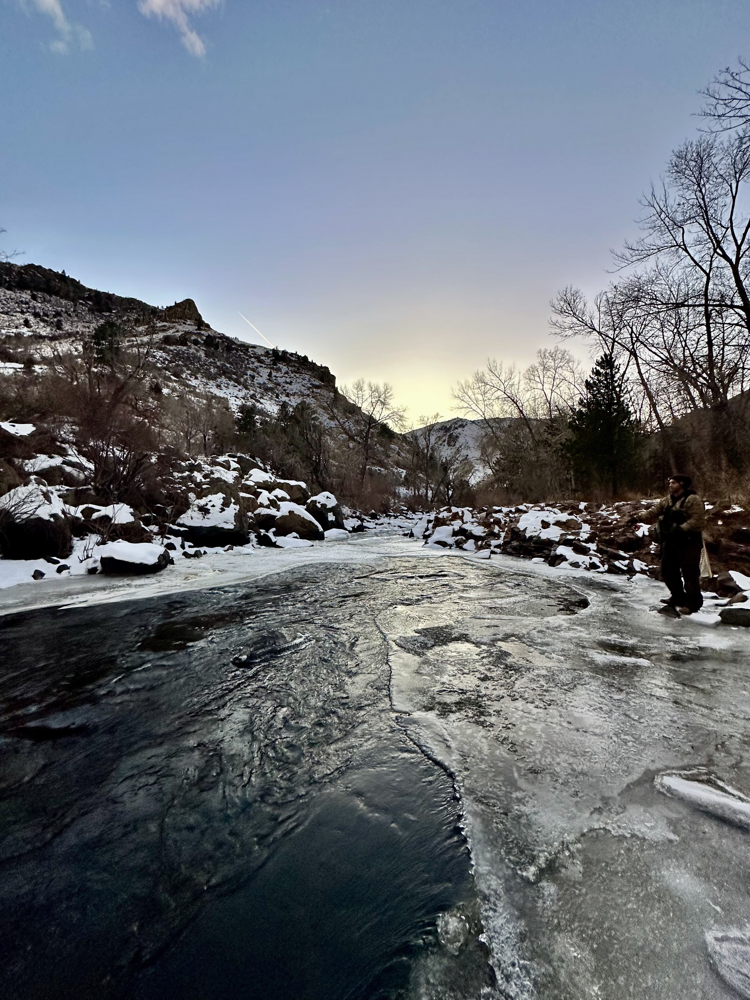

I had met my buddy Damian at the wedding in North Carolina a few weeks earlier (see my [Raleigh, NC](/2025-11-08-raleigh-north-carolina) trip) and we had bonded over fishing. He offered me the open spot on his
upcoming goose hunt, so of course I agreed.

When I arrived, we drove out to a National Forest to get familiar with the shotguns and get a bit of practice with clays.
Unfortunately we weren't successful as a snow storm set in and we actually got stuck in the snow for a concerning
amount of time. I almost passed out as we were leaving, again forgetting I live primarily at sea level and had just
turned up at 10,000ft of elevation. I swear my stupidity and Colorado will kill me one day, they aren't a good mix.

The hunt itself was a bit further north of Denver, so we made the early trip out and set ourselves up in an underground
blind with some heaters.

Ultimately we had a successful day! We were out most of the day, and took home 18 geese. Between 5 guys with guns,
our limit was 25, but a few of us (me especially) probably needed more time on our guns. I still hit at least 3, confident
on the two I took!

I really enjoyed the day, and I'll definitely be looking to get more into waterfowl hunting during the upcoming seasons,
especially since it's quite popular in Missouri.

The next day, we hit a few streams just outside Boulder to try and get some trout, but ultimately it was freezing cold
and we weren't having much success. I wasn't too bothered, hard to complain when you're out in such beautiful scenery!

