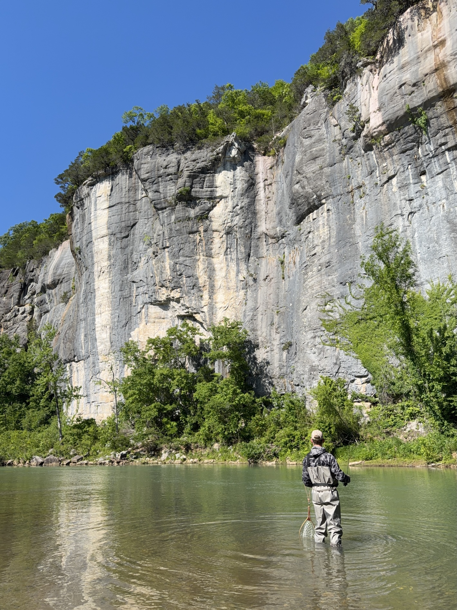
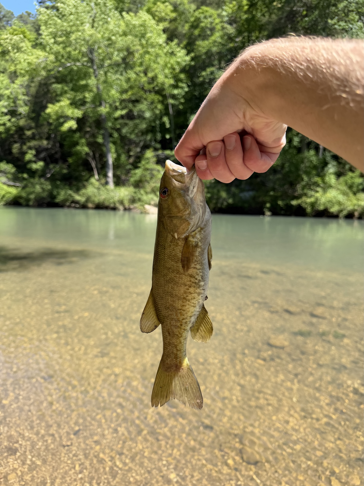
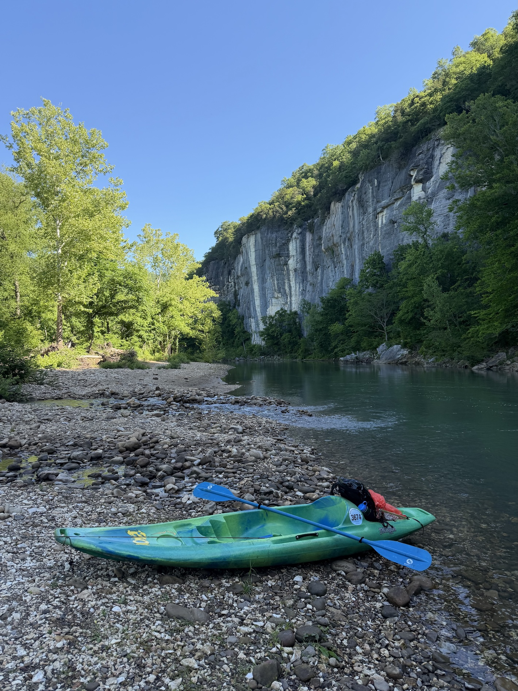

At the end of my Spring semester for grad school, I wanted to take a weekend to get offline and see a new part of the US.
I had never been to Arkansas despite it being within a few hours of St. Louis, so I looked at making a fishing weekend out of
my time off, especially since smallmouth bass can be found in the waters there! After arriving at my cabin Sunday morning,
I spent the rest of the day taking it easy before preparing to fish from Monday.

Early Monday, I headed to fish along the river near Ponca, AR. This was right next to where I would put in for kayaking the following
day, and while I didn't have any luck here, it was a beautiful start to the day.

After fishing near Ponca for most of the morning, I took my lunch break to visit the Ozark Cafe in Jasper, AR, then headed
to my campsite at Steel Creek to fish through the rest of the day. While I was only catching sunfish during this time,
I was surrounded by beautiful scenery, including these bluffs!

The following day, I organized to float a 10-mile stretch of the river on a kayak. This was an awesome day, starting early
in the morning from Ponca and floating while fishing. I found success somewhat early in the day, which was a welcome change
from having only caught sunfish! After casting into a rocky area at the edge of the river, I had my fly taken agressively
by what could only have been a smallie. Surprised, I was stripping my line in and had my net out the side of my kayak, but
unfortunately my leader snapped right as the fish was at the side of the kayak! Determined to not let this happen again
I pulled my kayak ashore nearby, waded out to fish that spot again, and thankfully I was rewarded.

Catching a smallie with my fly rod after hours and hours of trying was incredibly rewarding! I was elated. Taking plenty
of photos and releasing the smallie, I continued to float along the rest of the way.

All in all, I really enjoyed my few days in Arkansas. The Ozarks are incredibly beautiful, and I would highly recommend
floating or fishing along the Buffalo National River. I will be back!
